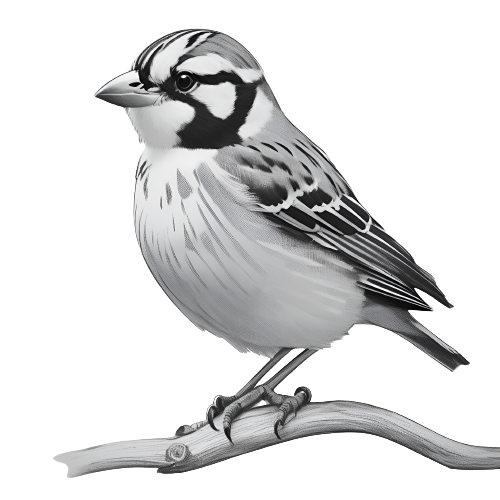

<h1 align="center"> Moineau </h1>
<p align="center">
  
</p>
<p align="center">An example app powered by Next.js.</p>

## Getting Started

To start the development server, create a `.env` file from `env.example`, update configuration values and run:

```bash
bun drizzle push:sqlite
bun -b dev
```
